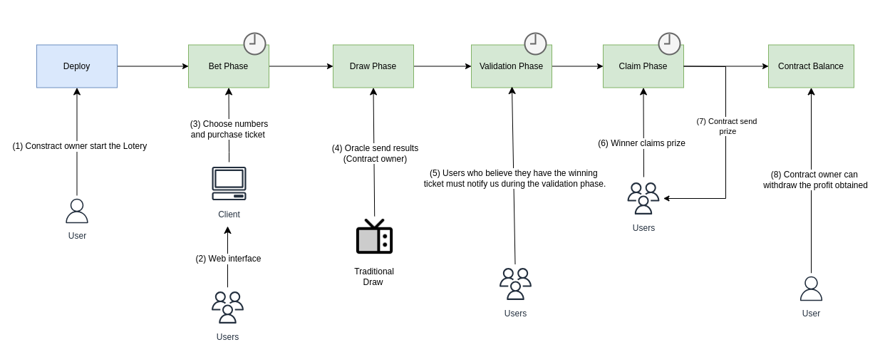

# 🍀 LuckyBlock
<i>A Lottery on the Blockchain</i>

## 🔍 Description

It is a decentralized lottery platform built on blockchain technology, designed to eliminate the main flaws of traditional lotteries—such as lack of transparency, vulnerability to fraud, loss of physical tickets, and delays in prize distribution.

### How the system would work ? 



#### 1. Start of the Lottery

An administrator (the contract owner) initializes a new lottery round via a Smart Contract.

#### 2. Ticket Purchase

Users access a web interface, choose their numbers, and purchase a ticket.

The bet is recorded on the blockchain by the smart contract, saving the player's wallet address and the selected numbers.

#### 3. Closing of Bets

After the deadline, the contract automatically blocks any new bets.

#### 4. Drawing (via Oracle)

The drawing takes place off-chain, using traditional methods.

An oracle then sends the drawn numbers to the smart contract on the blockchain.

#### 5. Validation

Players who believe they have a winning ticket must "notify" the contract (within the stipulated time window).

When notified, a check is made to confirm whether or not the player is a winner.

Only players who notify at this stage will be able to withdraw the prize in the future (if they are winners).

#### 6. Closing of Validation

After the deadline, the contract automatically blocks any new validation.

#### 7. Prize Distribution

Players who previously completed the validation (validation phase) and were confirmed as winners by the contract may request to withdraw their prize.

#### 8. End of Lottery

After the lottery closes, no user will be able to request the withdrawal of the prize.

### Contract Constraints

1. Maximum number of tickets per player limited to 10

2. Maximum number of winners per round is 1000

3. Valid numbers for betting must be between 1 and 60 (inclusive)

4. Currently the contract only allows winners who match 6/6 numbers

5. The lottery tickets (cards) sold only allow the choice of 6 numbers, with no additional value for choosing more numbers. 5. 
   
   For a bet to be considered the same as a winning one, it is not enough for it to have the same number; it must have the same sequence.

   For example, if the winning combination is [1, 2, 3, 4, 5, 6] and a player has a ticket with the combination [1, 2, 3, 4, 6, 5] he will not be considered a winner.


## ⚙️ Configuration

1. Requirements

* [Python](https://www.python.org/downloads/)
* [NPM](https://docs.npmjs.com/downloading-and-installing-node-js-and-npm)

2. Create a enviroment

```bash

# Create
$ python3 -m venv venv

# Activate env (Linux)
$ source venv/bin/activate
```

3. Install dependencies (hardhat, brownie and vyper)

```bash
# hardhat
$ npm install -g ganache
```

```bash
# brownie and vyper
$ pip install -r requirements.txt
```

> [!NOTE]
> 
> **Error while install brownie**: 
> ``` bash
> $ pip install eth-brownie
> cchecksum/_checksum.c:24:10: fatal error: Python.h: No such file or directory
>         24 | #include "Python.h"
>            |          ^~~~~~~~~~
>      compilation terminated.
>      error: command '/usr/bin/x86_64-linux-gnu-gcc' failed with exit code 1
>      [end of output]
>  
>  note: This error originates from a subprocess, and is likely not a problem with pip.
>  ERROR: Failed building wheel for cchecksum
> Failed to build cchecksum
> ERROR: Could not build wheels for cchecksum, which is required to install pyproject.toml-based projects 
> ```
> **Fix**:
> ```
> $ sudo apt install python3.12-dev build-essential 
> ```
> 

See more about [hardhat](https://github.com/NomicFoundation/hardhat), 
[brownie](https://github.com/eth-brownie/brownie) and 
[vyper](https://docs.vyperlang.org/en/stable/).

## 📌 How to run

### 1. Contract

If you want to run the contract and test it manually, copy and paste the file from the `contracts/` folder into the **REMIX IDE** 
* Remix IDE (Editor + Compilador + Deployer de Contratos) : https://remix.ethereum.org/

### 2. Tests

1. Run ganache-cli (Terminal 1)
```bash
$ cd src/
$ ganache-cli -p 8545 -i 1337
```

2. Run tests (Terminal 2)

```bash
$ cd src/
```

```bash
# Compile (src/ folder)
$ brownie compile

Brownie v1.21.0 - Python development framework for Ethereum
Project has been compiled. Build artifacts saved at /home/leticiacb/Documents/Blockchain/LuckyBlock/src/build/contracts
```

```bash
# Add ganache network
$ brownie networks add Ethereum ganache host=http://127.0.0.1:8545 chainid=1337

SUCCESS: A new network 'ganache' has been added
  └─ganache
    ├─id: ganache
    ├─chainid: 1337
    └─host: http://127.0.0.1:8545

# Test network
$ brownie console --network ganache
Brownie v1.21.0 - Python development framework for Ethereum

No project was loaded.
Brownie environment is ready.
>>> Ctrl + D

# Run tests (src/ folder)
$ brownie test

# The default network is defined in the brownie-config.yaml file as ganache network
```

```bash
# Run only one test file:
$ brownie test tests/test_buy_ticket.py::test_buy_ticket
```